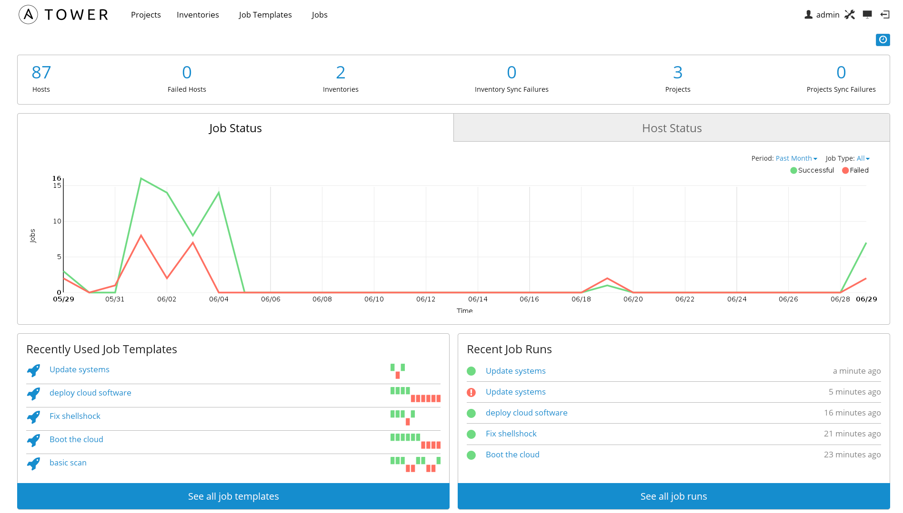

### Analyse comparative d'outils de déploiment et de configuration automatisée
TIM Fin de stage
Présenté par Valentin GOEMANNE

Sous la direction de Sébastien DUPONT 

Mai 2017

---
## Remerciment
---
## Sommaire
 - <span class ="fragment">Présentation de la problématique</span>  
 - <span class ="fragment">Présentation des solutions</span>
 - <span class ="fragment">Analyse comparative des solutions </span>

---

### La problématique ?
- <span class="fragment"> L'installation, la configuration et la maintenances des serveurs et/ou machine est très complexe </span>
- <span class="fragment"> Le déploiment d'application est compliquée </span>
+++


---
### Les solutions

- <span class="fragment">Chef</span>
- <span class="fragment">Puppet</span>
- <span class="fragment">Ansible</span>
- <span class="fragment">Saltstack</span>
- <span class="fragment">OpenShift</span>

+++
### Chef
- <span class="fragment">Opscode</span>
- <span class="fragment">2009</span>
- <span class="fragment">Ruby</span>
- <span class="fragment">Serveur/Client</span>
- <span class="fragment">3 modes de fonctionnement</span>
- <span class="fragment">Cookbooks</span>
- <span class="fragment">Apache 2.0</span>
+++
### Cookbooks
- <span class="fragment">Dossier</span>
- <span class="fragment">Recettes</span>
- <span class="fragment">Templates</span>

+++
### Recipes

```ruby
package  = "vim"

execute "apt-get update" do
 command "apt-get update"
end

apt_package package do
 action :install
end
```
+++
### Chef

- <span class="fragment">Workstation : machine admin </span>
- <span class="fragment">Serveur Chef </span>
- <span class="fragment">Node : machine cible </span>

+++
### Puppet

- <span class="fragment">Puppet Labs</span>
- <span class="fragment">2003</span>
- <span class="fragment">Ruby</span>
- <span class="fragment">Serveur/Client</span>
- <span class="fragment">Manifest en RubyDSL</span>
- <span class="fragment">Apache 2.0</span>

+++

### Ansible
- <span class="fragment">Ansible/Red Hat</span>
- <span class="fragment">2012</span>
- <span class="fragment">Python</span>
- <span class="fragment">Client</span>
- <span class="fragment">Playbook en YAML</span>
- <span class="fragment">GPL-3.0</span>
+++
### Ansible Tower

+++
### SaltStack
- <span class="fragment">Tom Hatch</span>
- <span class="fragment">2011</span>
- <span class="fragment">Python</span>
- <span class="fragment">Serveur/Client</span>
- <span class="fragment">State en YAML </span>
- <span class="fragment">Apache 2.0</span>
+++
### Technologie conteneur 
- <span class="fragment">Isolement d'un environement en utilisant les resources de la machine hote</span>
- <span class="fragment">Excution de logiciel en toute transparance sur n'importe quel environement</span>
- <span class="fragment"> Permet un déploiment très facile </span>

+++

### Virtualisation Vs Conteneurs


+++
### OpenShift V3 
- <span class="fragment">Orchestration de conteneur</span>
- <span class="fragment">Red Hat</span>
- <span class="fragment">Go</span>
- <span class="fragment">Systeme aliant Kubernetes et Docker </span>
- <span class="fragment">Apache 2.0</span>
---

### Les critères de comparaison 
- <span class="fragment">Facilité d'installation</span>
- <span class="fragment">Facilité d'utilisation</span>
- <span class="fragment">Scalable</span>
- <span class="fragment">Architecture</span>
+++

<table style="font-size: 60%;">
  <tr>
    <th>Solutions</th>
    <th>Facilité d'installation</th>
    <th>Facilité d'utilisation</th>
    <th>Scalable</th>
    <th>Archicteture</th>
  </tr>
  <tr>
    <td>Puppet</td>
    <td>°°</td>
    <td>°°°</td>
    <td>°°°</td>
    <td>Serveur/Client</td>
  </tr>
    <tr>
    <td>Chef</td>
    <td>°°°</td>
    <td>°°°</td>
    <td>°°°</td>
    <td>Serveur/Client</td>
  </tr>
    <tr>
    <td>Ansible</td>
    <td>°°°°</td>
    <td>°°°</td>
    <td>°°°</td>
    <td>Client</td>
  </tr>
    <tr>
    <td>SaltStack</td>
    <td>°°°</td>
    <td>°°°</td>
    <td>°°°</td>
    <td>Serveur/Client</td>
  </tr>
    <tr>
    <td>OpenShift</td>
    <td>°°°°</td>
    <td>°°°°</td>
    <td>°°°°</td>
    <td>Serveur</td>
  </tr>
</table>


+++
### Résumé 
<table style="font-size: 40%;">
  <tr>
    <th>Solutions</th>
    <th>Facilité d'installation</th>
    <th>Facilité d'utilisation</th>
    <th>Scalable</th>
    <th>Archicteture</th>
    <th>Licence</th>
    <th>Repositeries officiel</th>
    <th>Ecrit en</th>
    <th>Fichier de travail</th>
    <th>Language fichier </th>
  </tr>
  <tr>
    <td>Puppet</td>
    <td>°°</td>
    <td>°°°</td>
    <td>°°°</td>
    <td>Serveur/Client</td>
    <td>Apache 2.0</td>
    <td>Puppet Forge</td>
    <td>Ruby</td>
    <td>Manifest</td>
    <td>RubyDSL</td>
  </tr>
    <tr>
    <td>Chef</td>
    <td>°°°</td>
    <td>°°°</td>
    <td>°°°</td>
    <td>Serveur/Client</td>
    <td>Apache 2.0</td>
    <td>Chef Supermarket</td>
    <td>Ruby, Erlang</td>
    <td>Recipe</td>
    <td>RubyDSL</td>
  </tr>
    <tr>
    <td>Ansible</td>
    <td>°°°°</td>
    <td>°°°</td>
    <td>°°°</td>
    <td>Client</td>
    <td>GPL-3.0</td>
    <td>Ansible Galaxy</td>
    <td>Python, PowerShell</td>
    <td>Playbook</td>
    <td>YAML</td>
  </tr>
    <tr>
    <td>SaltStack</td>
    <td>°°°</td>
    <td>°°°</td>
    <td>°°°</td>
    <td>Serveur/Client</td>
    <td>Apache 2.0</td>
    <td>SaltStack Project</td>
    <td>Python</td>
    <td>State</td>
    <td>YAML</td>
  </tr>
    <tr>
    <td>OpenShift</td>
    <td>°°°°</td>
    <td>°°°°</td>
    <td>°°°°</td>
    <td>Serveur</td>
    <td>Apache 2.0</td>
    <td>Docker Hub</td>
    <td>Go</td>
    <td>Dockerfile</td>
    <td>DSL</td>
  </tr>
</table>

---
### Prochaine étapes 

- <span class="fragment">Reprendre chaque logiciel et exploiter toute leur puissance</span>
- <span class="fragment">Se familiarisé plus avec Docker/OpenShitf </span>
---

### liens

- https://www.ansible.com
- https://puppet.com/fr
- https://www.chef.io/chef/
- https://saltstack.com
- https://www.openshift.com

---

### Questions? 

