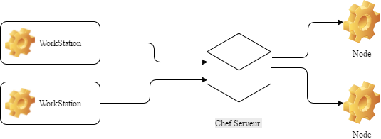

### Analyse comparative d'outils de déploiment et de configuration automatisée
Stage de fin d'étude réalisé au CETIC
Présenté par Valentin GOEMANNE

Sous la direction de Sébastien DUPONT et de Michel HANOTIAUX

Mai 2017

---
## Sommaire
 - <span class ="fragment">Le CETIC ? C'est quoi ?</span>  
 - <span class ="fragment">Etat de l'art</span>
 - <span class ="fragment">Analyse comparative d'outils de déploiement et de configuration automatisée </span>
 - <span class ="fragment"> Conclusion </span> 

---

## Le CETIC ? C'est quoi ?
<strong class="fragment">C</strong>entre d'<strong class="fragment">E</strong>xcellence <strong class="fragment">T</strong>echnologie de l'<strong class="fragment">I</strong>nformation et de la <strong class="fragment">C</strong>ommunication 

+++
### Présentation
- <span class="fragment">ASBL</span>
- <span class="fragment">45 personnes</span>
- <span class="fragment">15 ans</span>
- <span class="fragment">Zoning de Gosselies</span>

---
## Etat de l'art
- <span class="fragment">Le versionning </span>
- <span class="fragment">Le cloud</span>
- <span class="fragment">La virtualisation</span>
- <span class="fragment">Les conteneurs</span>
- <span class="fragment">Chocolatey</span>

+++
### Le versionning 

- <span class="fragment">Git </span>
- <span class="fragment">GitLab</span>

+++

### La Virtualisation 

Hyperviseur
- <span class="fragment" style="color:grey">Type Natif</span>
- <span class="fragment" style="color:grey">Type Hosted</span>

    

+++

### La Virtualisation 


+++

### La virtualisation 

#### Vagrant 


```ruby
Vagrant.configure(2) do |config|
   #Pour toute les machine qui fonctionne avec virtualbox
   config.vm.provider "virtualbox" do |vb|
    vb.memory = "512" 
  end

  #Configuration de la VM "VM1"
  config.vm.define "VM1" do |machine|
    machine.vm.box = "centos6.7"   #Nom de la box utilisée
    machine.vm.hostname = "TestVM1"     #Hostname de la VM
    machine.vm.network :private_network, ip: "192.168.10.191"   
    #Création d'un réseau privé avec l'ip mentionné 
  end

  #Configuration de la VM "VM2"
  config.vm.define "VM2" do |machine|
    machine.vm.box = "centos6.7"    #Nom de la box utilisée
    machine.vm.hostname = "TestVM2"      #Hostname de la VM
    machine.vm.network :private_network, ip: "192.168.10.192"   ##Création d'un réseau privé avec l'ip mentionné
  end
end
```
+++

### Les Conteneurs 


+++
### Chocolatey
- <span class="fragment">Gestionnaires de paquets pour Windows </span>


---
## Analyse comparative d'outils de déploiment et de configuration automatisée 

+++
### La problématique ?
- <span class="fragment">L'installation et la configuration de serveurs ou de machines prend du temps</span>

+++

### Les solutions

- <span class="fragment">Puppet</span>
- <span class="fragment">Chef</span>
- <span class="fragment">Ansible</span>
- <span class="fragment">Saltstack</span>
- <span class="fragment">Rudder</span>
- <span class="fragment">OpenShift</span>

+++

### Les critères de comparaison 
- <span class="fragment">Facilité d'installation</span>
- <span class="fragment">facilité d'utilisation</span>
- <span class="fragment">Scalable</span>
- <span class="fragment">Architecture</span>
- <span class="fragment">Repositerie</span>
- <span class="fragment">Langage</span>
- <span class="fragment">Plateformes supportées</span>

+++
### Exemple: Chef


---


### Conclusion 

- <span class="fragment">Autonomie</span>
- <span class="fragment">Curiosité</span>