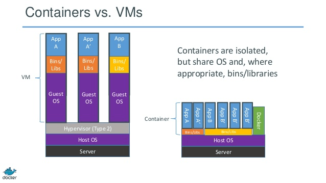

### Analyse comparative d'outils de déploiment et de configuration automatisée
TIM Fin de stage
Présenté par Valentin GOEMANNE

Sous la direction de Sébastien DUPONT 

Mai 2017

---
## Remerciment
---
## Sommaire
 - Présentation de la problématique  
 - Présentation des solutions
 - Analyse comparative des solutions 

---

### La problématique ?
-  L'installation et la configuration de serveurs ou de machines prend du temps 

+++

---

### Les solutions

- Puppet
- Chef
- Ansible
- Saltstack
- OpenShift

+++
### Puppet

- Puppet Labs
- 2003
- Ruby
- Serveur/Client
- SSL
- Manifest en RubyDSL
- Apache 2.0
+++
#### OpenSource vs Entreprise
<table style="font-size: 50%;">
  <tr>
    <th></th>
    <th>OpenSource</th>
    <th>Entreprise</th>
  </tr>
  <tr>
    <td>Interface graphique</td>
    <td>No</td>
    <td>Yes</td>
  </tr>
  <tr>
    <td>Permision des utilisateurs</td>
    <td>No</td>
    <td>Yes</td>
  </tr>
  <tr>
    <td>Prix</td>
    <td>0 euro</td>
    <td>~100 euro standard
    ~150 euro prenium</td>
  </tr>
</table>

+++
### Chef
- Opscode
- 2009
- Ruby
- Serveur/Client
- SSH
- Recipes en RubyDSL
- Apache 2.0
+++
### Chef

+++
### Ansible
- Ansible/Red Hat
- 2012
- Python
- Client
- SSH
- Playbook en YAML
- GNU
+++
### Ansible Tower

+++
### SaltStack
- Tom Hatch
- 2011
- Python
- Serveur/Client
- State en YAML 
- Apache 2.0
+++
### Virtualisation Vs Conteneurs

+++
### OpenShift 

---

### Les critères de comparaison 
- Facilité d'installation
- Facilité d'utilisation
- Scalable
- Architecture
- Repositerie
- Langage
- Plateformes supportées

+++
<table style="font-size: 50%;">
  <tr>
    <th>Solutions</th>
    <th>Facilité d'installation</th>
    <th>Facilité d'utilisation</th>
    <th>Scalable</th>
    <th>Archicteture</th>
    <th>Licence</th>
    <th>Repositeries</th>
    <th>Ecrit en</th>
    <th>Fichier de travail</th>
    <th>Language fichier </th>
  </tr>
  <tr>
    <td>Puppet</td>
    <td>°°</td>
    <td>°°°</td>
    <td>°°°</td>
    <td>Serveur/Client</td>
    <td>Apache 2.0</td>
    <td>Forge</td>
    <td>Ruby</td>
    <td>Manifest</td>
    <td>RudyDSL</td>
  </tr>
    <tr>
    <td>Chef</td>
    <td>°°°</td>
    <td>°°°</td>
    <td>°°°</td>
    <td>Serveur/Client</td>
    <td>Apache 2.0</td>
    <td>Supermarket</td>
    <td>Ruby, Erlang</td>
    <td>Recipe</td>
    <td>RudyDSL</td>
  </tr>
    <tr>
    <td>Ansible</td>
    <td>°°°°</td>
    <td>°°°</td>
    <td>°°°</td>
    <td>Client</td>
    <td>GNU</td>
    <td>Galaxy</td>
    <td>Python, PowerShell</td>
    <td>Playbook</td>
    <td>RudyDSL</td>
  </tr>
    <tr>
    <td>SaltStack</td>
    <td>°°°</td>
    <td>°°°</td>
    <td>°°°</td>
    <td>Serveur/Client</td>
    <td>Apache 2.0</td>
    <td>Project</td>
    <td>Python</td>
    <td>State</td>
    <td>YAML</td>
  </tr>
    <tr>
    <td>OpenShift</td>
    <td>***</td>
    <td>***</td>
    <td>***</td>
    <td>Serveur</td>
    <td>Apache 2.0</td>
    <td>Docker Hub</td>
    <td>/</td>
    <td>Dockerfile</td>
    <td>DSL</td>
  </tr>
</table>

